<p align="center">
  
</p>

<h1 align="center">Spoonmate</h1>

<p align="center">
  <b>Your recipes, your way.</b><br>
  A self-hosted recipe manager with a web app and a native iPhone app.<br>
  Import from anywhere, plan the week, build the shopping list, and cook step by step, even offline.
</p>

<p align="center">
  <a href="https://hub.docker.com/r/juzzycooks/recipemanager"></a>
  
  
  <a href="LICENSE"></a>
</p>

<p align="center">
  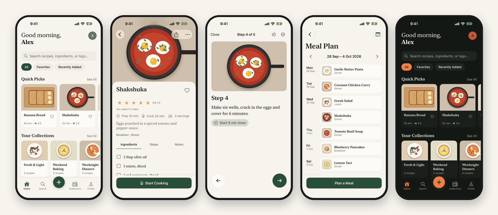
</p>

---

## What it is

Spoonmate runs on your own server (a Docker container, at home or on Unraid) and keeps one shared library of recipes for your household. You use it from any browser, or from the iPhone app, which talks to the same server through a small JSON API.

Nothing leaves your machine except what you choose to share: public links for a recipe, a collection or a week's meal plan.

- **One container, one volume.** SQLite and your pictures live in `/app/data`. Back up the folder and you have everything.
- **Private by default.** Accounts, scrypt passwords, CSRF protection, login rate limiting, SSRF-guarded imports.
- **Works on a phone in the kitchen.** Big type, a screen that stays awake, step-by-step cooking and timers.

---

## Screenshots

### iPhone

<table>
<tr>
<td align="center" width="25%">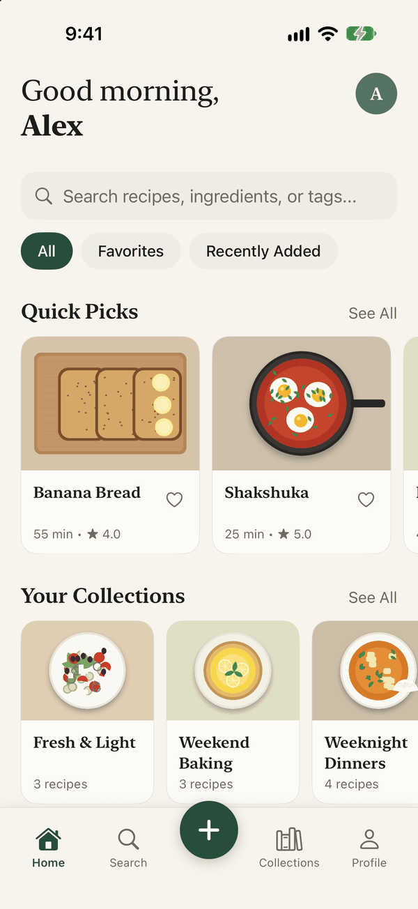<br><sub><b>Home</b><br>Quick picks and collections</sub></td>
<td align="center" width="25%">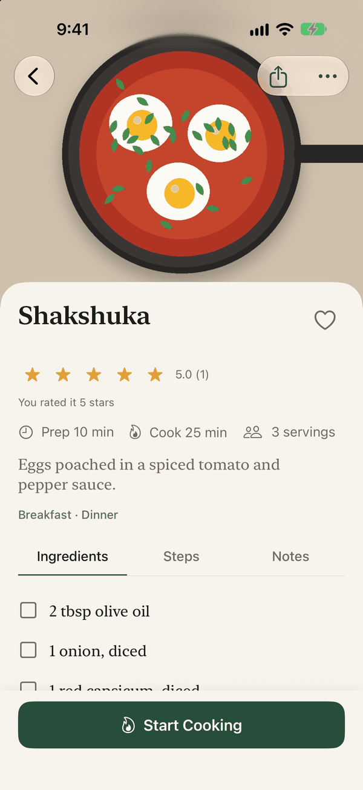<br><sub><b>Recipe</b><br>Ingredients, rating, plan, share</sub></td>
<td align="center" width="25%">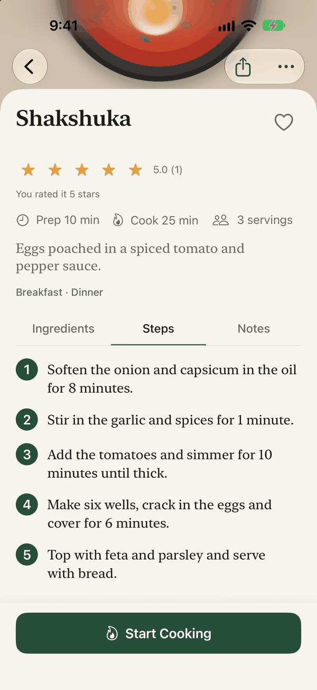<br><sub><b>Steps</b><br>Numbered method</sub></td>
<td align="center" width="25%">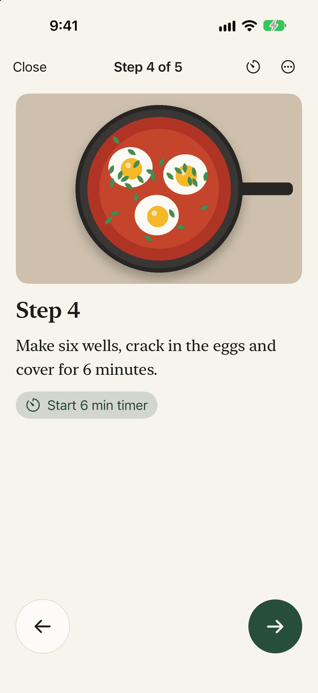<br><sub><b>Cooking mode</b><br>One step at a time, timers from the text</sub></td>
</tr>
<tr>
<td align="center">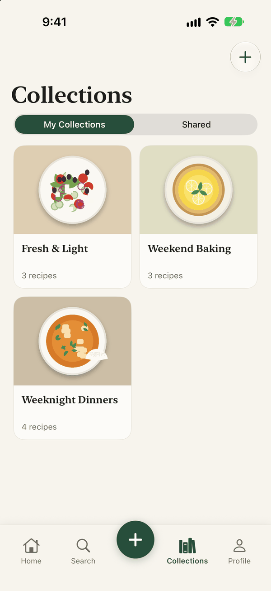<br><sub><b>Collections</b><br>Themed sets with public links</sub></td>
<td align="center">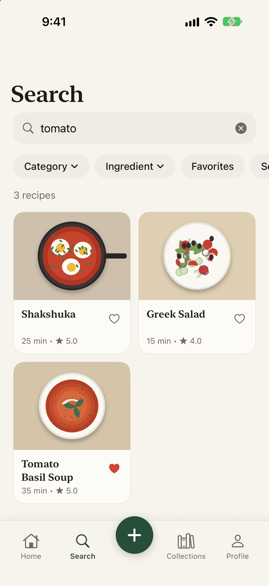<br><sub><b>Search</b><br>Titles and ingredients, with filters</sub></td>
<td align="center">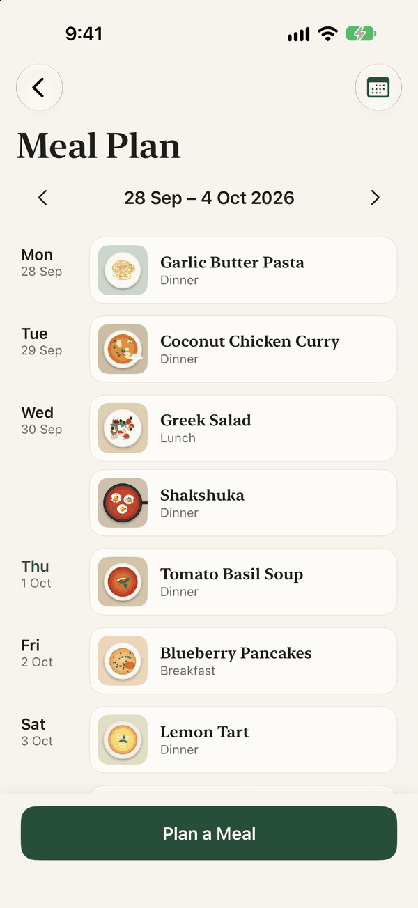<br><sub><b>Meal plan</b><br>A week at a glance</sub></td>
<td align="center">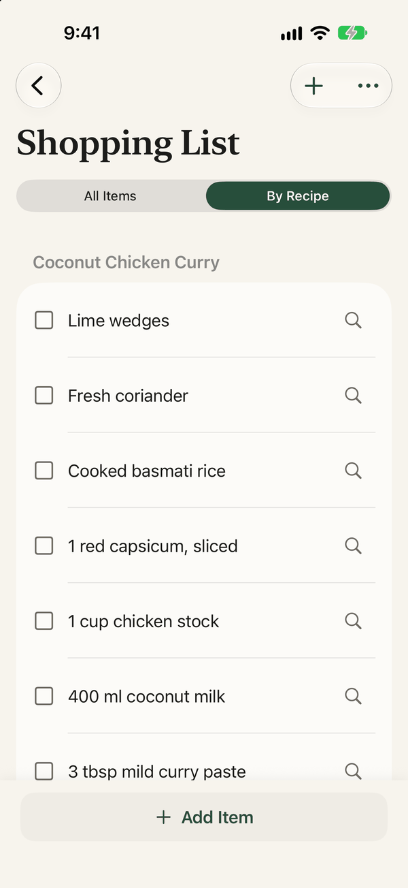<br><sub><b>Shopping list</b><br>By aisle or by recipe</sub></td>
</tr>
<tr>
<td align="center">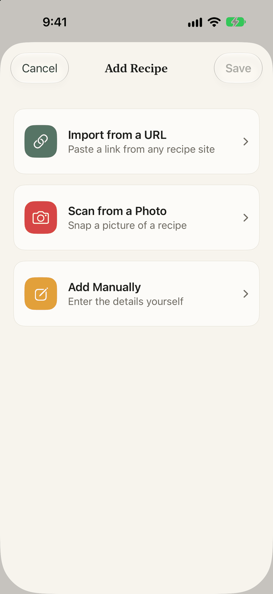<br><sub><b>Add a recipe</b><br>Link, photo scan or by hand</sub></td>
<td align="center">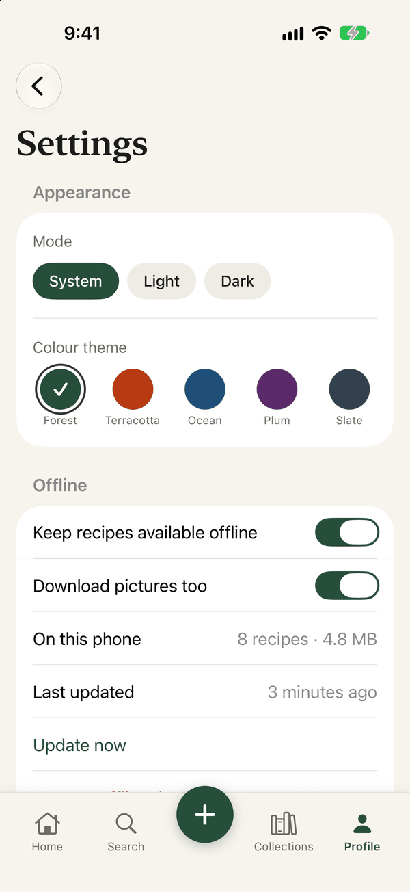<br><sub><b>Settings</b><br>Light/dark, five colour themes, offline</sub></td>
<td align="center">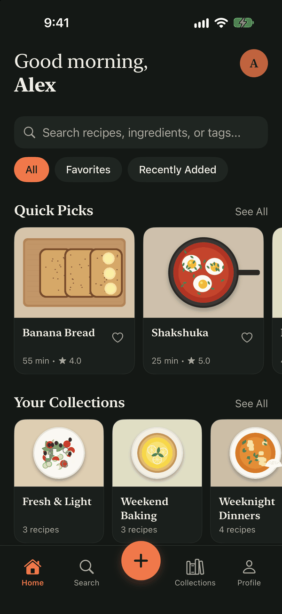<br><sub><b>Dark + Terracotta</b><br>Every screen follows the theme</sub></td>
<td align="center">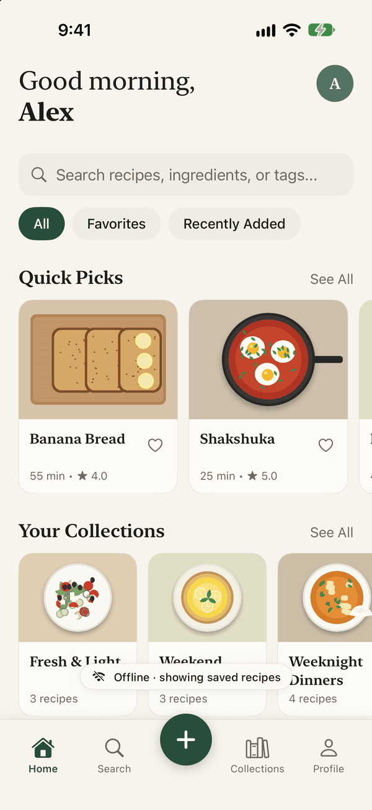<br><sub><b>Offline</b><br>Everything still opens</sub></td>
</tr>
</table>

### Web

<p align="center">
  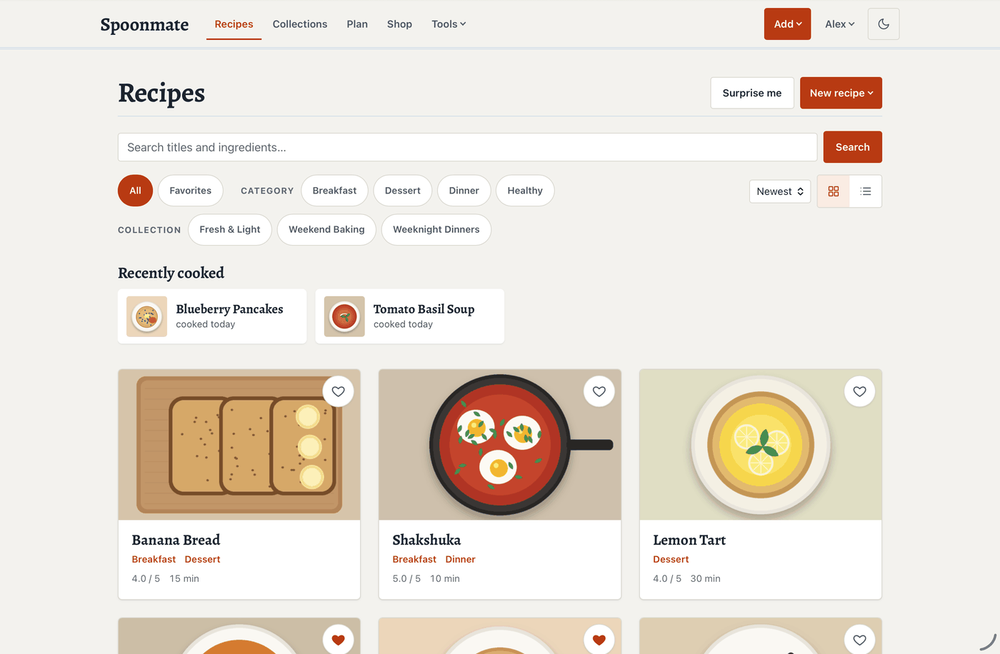<br>
  <sub><b>The shelf.</b> Search, filter by category or collection, recently cooked, grid or list.</sub>
</p>

<table>
<tr>
<td width="50%">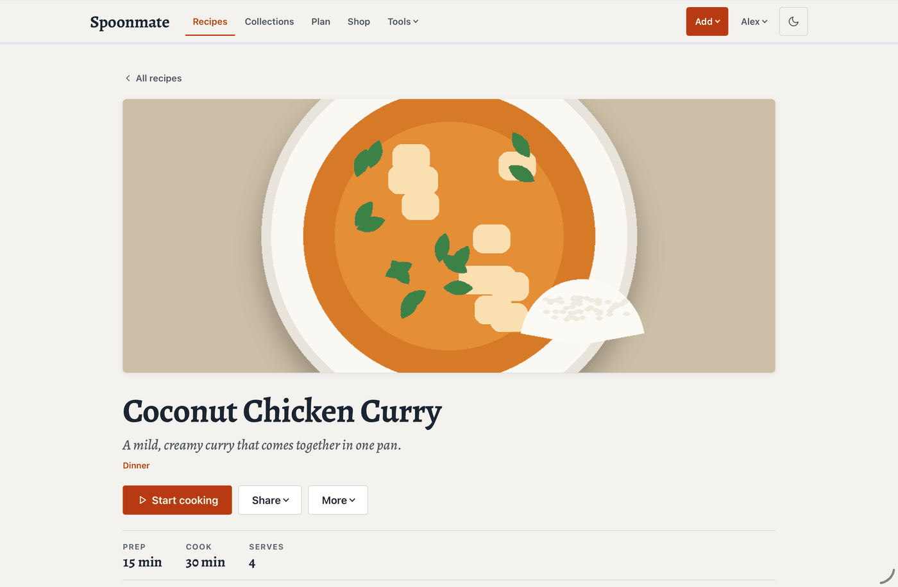<br><sub><b>Recipe page.</b> Start cooking, share, print, export, ratings, notes and comments.</sub></td>
<td width="50%">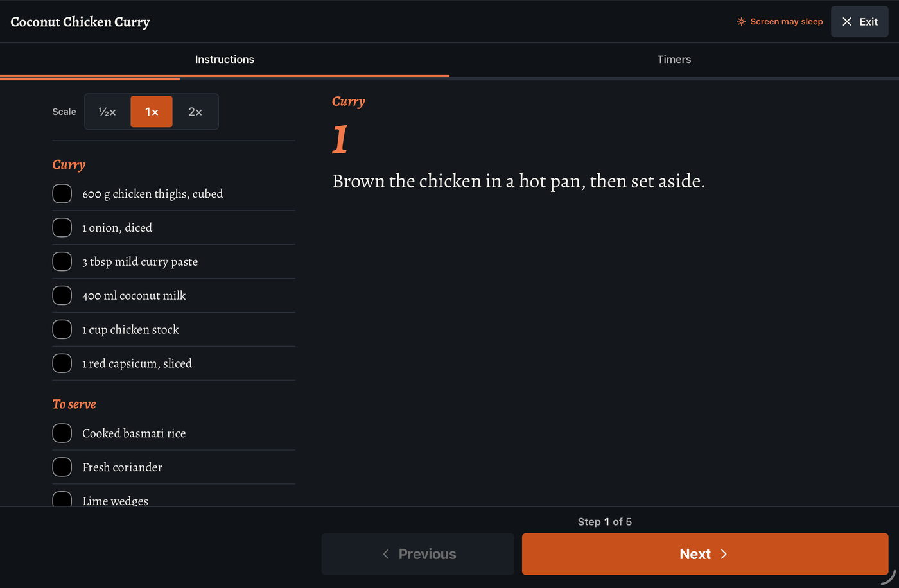<br><sub><b>Cook mode.</b> Chalkboard theme, ingredient checklist, ½× / 1× / 2× scaling, timers.</sub></td>
</tr>
<tr>
<td width="50%">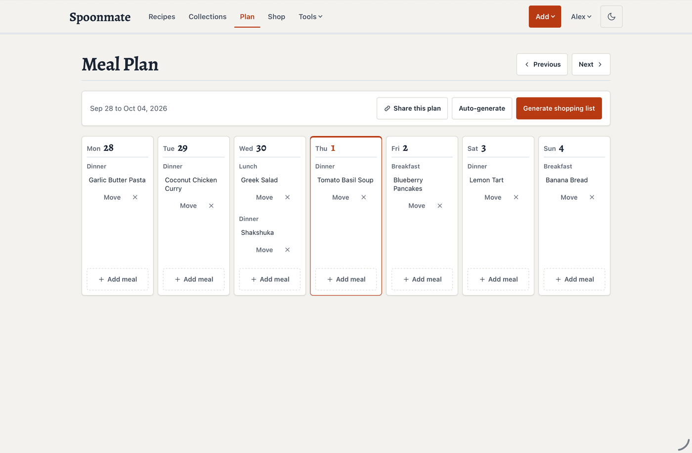<br><sub><b>Meal plan.</b> Drag meals between days, auto-generate a week, share a read-only link.</sub></td>
<td width="50%">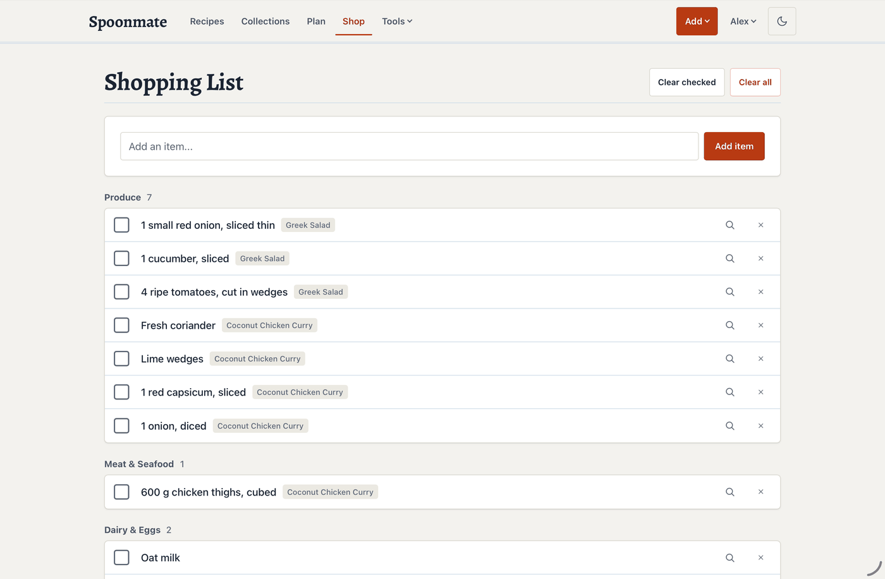<br><sub><b>Shopping list.</b> Merges duplicates, groups by aisle, tags each item with its recipe.</sub></td>
</tr>
<tr>
<td colspan="2">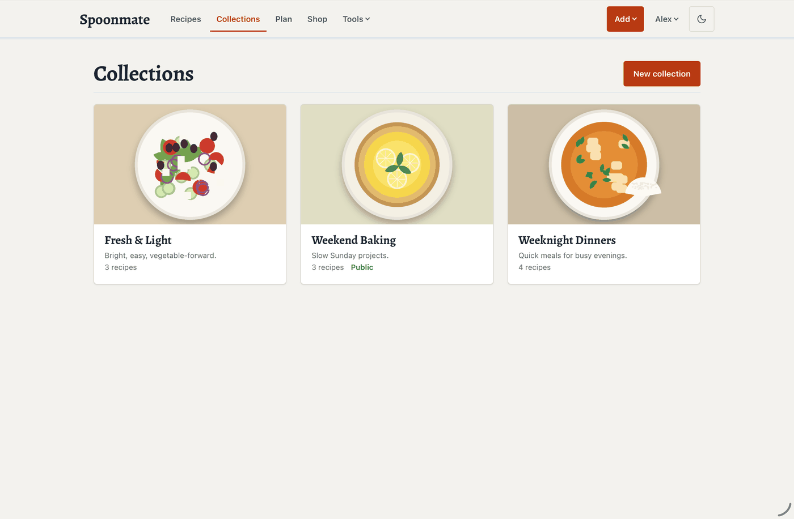<br><sub><b>Collections.</b> Custom covers, your own URL slug, public pages with cook mode and print view.</sub></td>
</tr>
</table>

> The screenshots use a demo library with original recipes and illustrations drawn by [`tools/seed_demo.py`](tools/seed_demo.py), so you can reproduce them on a fresh server.

---

## Features

<table>
<tr>
<td width="50%" valign="top">

### Recipes
- Import from a **link** (single or bulk), **Instagram / TikTok** captions, **photos and screenshots** (OCR), **PDF** cookbooks, and **Mealie**
- Pictures are saved on your server, so dead links don't break your shelf
- Search titles and ingredients; filter by category, collection or favourites
- Favourites, 1-5 star ratings, comments, personal notes
- "I made this" history and a *Recently cooked* shelf
- Undo a delete for 24 hours; duplicate, edit, print, export, email
- Section headings (`# For the sauce`) in ingredients and method
- Rough nutrition estimate from the ingredient list

</td>
<td width="50%" valign="top">

### Plan and shop
- Weekly meal plan with breakfast, lunch, dinner and snack slots
- Auto-fill a week, drag meals around, share the plan read-only
- One tap turns the plan (or a recipe) into a shopping list
- Duplicates merge ("2 cups flour" + "1 cup flour" = "3 cups flour")
- Items grouped by **aisle** or by **recipe**
- Optional "find it at your store" link per item

</td>
</tr>
<tr>
<td width="50%" valign="top">

### Collections and sharing
- Group recipes into themed collections, or fill one from a category
- Custom covers, custom URL slugs, drag to reorder
- Public links for a recipe, a collection or a meal plan (no login)
- Public pages have cook mode, a print view, dark mode and social previews
- You decide what's public. A shared recipe shows the recipe and its notes; comments and ratings are never shown

</td>
<td width="50%" valign="top">

### Cook mode
- Full screen, one step at a time, screen kept awake
- Ingredient checklist and **½× / 1× / 2×** scaling (web)
- **Timers** found in the method text ("simmer for 20 minutes")
- On iPhone 26.1+, timers are real Clock-style alarms with a Lock Screen and Dynamic Island countdown

</td>
</tr>
<tr>
<td width="50%" valign="top">

### iPhone app
- Native SwiftUI for iOS 18+: home, search, collections, plan, shopping, settings
- **Offline**: your whole library and pictures are kept on the phone; favourites, ratings and shopping list edits made offline sync later
- **Share extension**: save a recipe from Safari with two taps
- Light, dark and five colour themes
- Admin tools for admins: site settings, users, categories

</td>
<td width="50%" valign="top">

### Admin and security
- Users with admin roles; first account becomes the admin
- SMTP email for welcome, password reset and sending recipes
- Custom site name, logo and shopping store link
- Backups: JSON or ZIP export, database download, import
- CSRF protection, login rate limiting, scrypt hashing
- Content-Security-Policy and security headers
- Uploads are re-encoded (metadata stripped) and size-capped
- Automatic database migrations on startup

</td>
</tr>
</table>

---

## Quick start

### Docker Compose

```yaml
services:
  spoonmate:
    image: juzzycooks/recipemanager:latest
    container_name: spoonmate
    ports:
      - "8114:5000"
    volumes:
      - ./data:/app/data          # recipes.db, uploads/ and the secret key live here
    environment:
      # Optional: email for welcome / password reset / "email this recipe"
      - SMTP_HOST=smtp.gmail.com
      - SMTP_PORT=465
      - SMTP_USER=you@gmail.com
      - SMTP_PASS=your-app-password
      - SMTP_FROM=you@gmail.com
      - SMTP_TLS=true
    restart: unless-stopped
```

```bash
docker compose up -d
```

> The image is published as `juzzycooks/recipemanager`. Spoonmate is the product name; the image and repo keep their original name so existing installs keep updating.

### Unraid

A Community Applications template is in this repo ([`recipemanager.xml`](recipemanager.xml)). Or add the container by hand: repository `juzzycooks/recipemanager`, port `5000` (e.g. host `8114`), and a path mapping from `/app/data` to `/mnt/user/appdata/RecipeManager` (the template's default).

### First run

1. Open `http://your-server:8114`.
2. Create your account. **The first user is the admin.**
3. Under **Admin → Site settings** set the site name, logo, and the store used for shopping-list search links.
4. Add recipes from **Add** (link, photo, PDF, Mealie or by hand), or import a backup.

### Putting it on the internet

The iPhone app works anywhere you can reach the server, but **iOS requires HTTPS** for anything that isn't on your local network, and the app's token is a password. Put Spoonmate behind a reverse proxy (Nginx Proxy Manager, Caddy, Traefik) with a certificate, then set:

| Variable | Why |
|:--|:--|
| `TRUSTED_PROXY=1` | real client IPs behind the proxy, so login rate limiting works |
| `COOKIE_SECURE=1` | send session cookies over HTTPS only |

---

## The iPhone app

The app lives in [`IOS/`](IOS/). It is not on the App Store; build it yourself with Xcode and install it on your own phone.

```bash
brew install xcodegen
cd IOS
xcodegen generate        # creates RecipeManager.xcodeproj from project.yml
open RecipeManager.xcodeproj
```

1. In Xcode select the **RecipeManager** target and choose your **Team** under *Signing & Capabilities* (do the same for the two extensions). A free Apple ID works for installing on your own device (apps expire after 7 days); TestFlight needs the paid programme.
2. Run on your iPhone. Enter your server address and your normal username and password.

What it needs from the server: the JSON API described in [`API.md`](API.md), which ships in the same image. Keep the server and app reasonably up to date together.

Details, architecture, the offline design and the share extension are documented in [`IOS/README.md`](IOS/README.md). Planning to publish it yourself? [`IOS/APP_STORE.md`](IOS/APP_STORE.md) is a step-by-step App Store guide (iPhone only), and [`PRIVACY.md`](IOS/AppStore/PRIVACY.md) is a ready-made privacy policy.

**Good to know:** the ringing Clock-style timer and the Live Activity need iOS 26.1 or later and a real device (the simulator always denies AlarmKit); older iOS gets a repeating notification instead. Keychain Sharing is used so the Safari extension can see your sign-in.

---

## Configuration

| Variable | Description | Default |
|:--|:--|:--|
| `DATA_DIR` | Where the database and uploads are stored inside the container | `/app/data` |
| `FLASK_SECRET_KEY` | Session signing key | generated and saved to `DATA_DIR/.secret_key` |
| `SMTP_HOST` / `SMTP_PORT` | Mail server (`465` for Gmail SSL) | none / `587` |
| `SMTP_USER` / `SMTP_PASS` | Mail login (use an app password) | none |
| `SMTP_FROM` | Sender address | none |
| `SMTP_TLS` | Use TLS/SSL | `true` |
| `PUID` / `PGID` | User and group the app runs as (the container drops root) | `99` / `100` |
| `TRUSTED_PROXY` | Set to `1` behind a reverse proxy | unset |
| `COOKIE_SECURE` | Set to `1` when served over HTTPS | unset |

### Data and backups

```
/app/data/
├── recipes.db        SQLite database
├── uploads/          recipe pictures, collection covers, logo
├── trash/            deleted recipes kept for 24 hours (undo)
└── .secret_key       generated session key
```

Back up this folder and you have everything. **Admin → Backup** also exports your recipes as JSON or ZIP and can download the database.

---

## JSON API

Every part of the app is available over a token-authenticated JSON API at `/api/v1`: recipes, import, collections, meal plan, shopping list, search, sharing and admin. The iPhone app is built on it, and so can your own scripts.

```bash
TOKEN=$(curl -s https://your-server/api/v1/auth/login \
  -H 'Content-Type: application/json' \
  -d '{"username":"me","password":"..."}' | python3 -c 'import sys,json;print(json.load(sys.stdin)["token"])')

curl -s 'https://your-server/api/v1/recipes?q=soup' -H "Authorization: Bearer $TOKEN"
```

The full reference is in [`API.md`](API.md).

---

## Development

Python 3.10 or newer.

```bash
python3 -m venv .venv && source .venv/bin/activate
pip install -r requirements.txt

# run the server on http://localhost:5000 (data goes in ./data)
DATA_DIR=./data python -c "from app import create_app; create_app().run(port=5000)"

# tests
python -m unittest discover -s tests -t .      # server, import, API
node tests/test_cook.js                        # cook-mode logic
python tests/smoke_routes.py                   # renders every route, reports server errors
```

Useful tools:

| | |
|:--|:--|
| `python3 tools/seed_demo.py http://localhost:5078` | fills an empty server with the demo library used in the screenshots |
| `python3 tools/generate_icons.py` | redraws the app icon and writes the iPhone and web icons |

iPhone tests: `xcodebuild test -project IOS/RecipeManager.xcodeproj -scheme RecipeManager -destination 'platform=iOS Simulator,name=iPhone 17'` (they decode real server responses saved in `IOS/RecipeManagerTests/Fixtures`).

### Build and publish the image

```bash
docker buildx build --platform linux/amd64,linux/arm64 \
  -t juzzycooks/recipemanager:latest -t juzzycooks/recipemanager:$(git rev-parse --short HEAD) --push .
```

Tag every push with the commit hash so a rollback is one `docker pull`.

### Project layout

```
app.py            app factory, security headers, template helpers
models.py         SQLAlchemy models
routes/           one blueprint per area (recipes, collections, mealplan, shopping, admin, auth, extras) and api_v1.py
scraper.py        link import (JSON-LD, microdata, common recipe plugins, Instagram/TikTok)
recipe_text.py    parses loose text (captions, PDFs, OCR) into a recipe
ocr.py            Tesseract wrapper for photo import
shopping_utils.py ingredient parsing, merging and aisle grouping
templates/        Jinja templates      static/  CSS, JS, fonts, icons, guides
IOS/              the iPhone app (SwiftUI, XcodeGen)
tools/            demo data and icon generators
docs/screenshots/ the images in this README
tests/            unittest suites, cook-mode tests, smoke test
```

The visual system ("The Well-Used Cookbook") is described in [`DESIGN.md`](DESIGN.md) and the product intent in [`PRODUCT.md`](PRODUCT.md). [`HANDOFF.md`](HANDOFF.md) is the maintainer's guide.

---

## Tech stack

| | |
|:--|:--|
| Server | Flask, Gunicorn, SQLAlchemy, SQLite |
| Auth | Flask-Login, scrypt, bearer tokens for the API |
| Import | BeautifulSoup, pypdf, Tesseract OCR, Pillow |
| Web | Jinja2, plain CSS and vanilla JS, self-hosted fonts |
| iPhone | SwiftUI, Observation, AlarmKit, ActivityKit, Keychain sharing, XcodeGen |
| Container | Multi-stage Alpine image for amd64 and arm64 |

---

## License

Spoonmate is released under the [MIT License](LICENSE). That covers the server, the iPhone app, the tools, and the demo illustrations in `docs/` and `tools/seed_demo.py`.

The Alegreya typeface bundled in `static/fonts/` is by The Alegreya Project Authors and is licensed separately under the SIL Open Font License 1.1 (see [`static/fonts/OFL.txt`](static/fonts/OFL.txt)).
